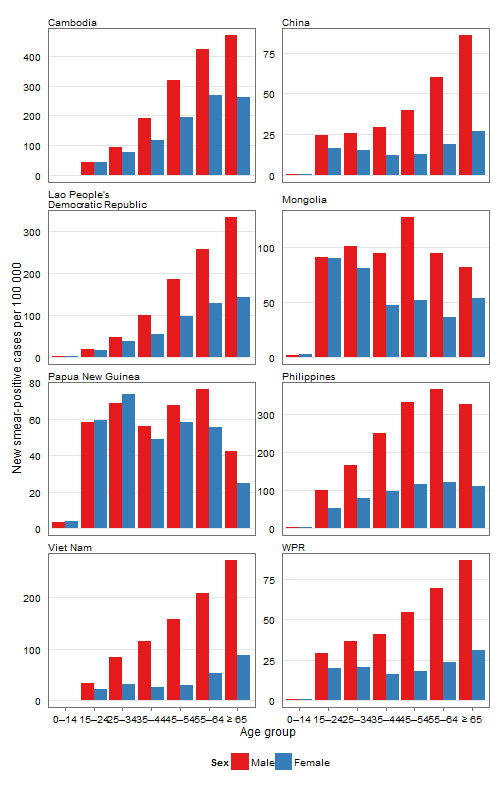
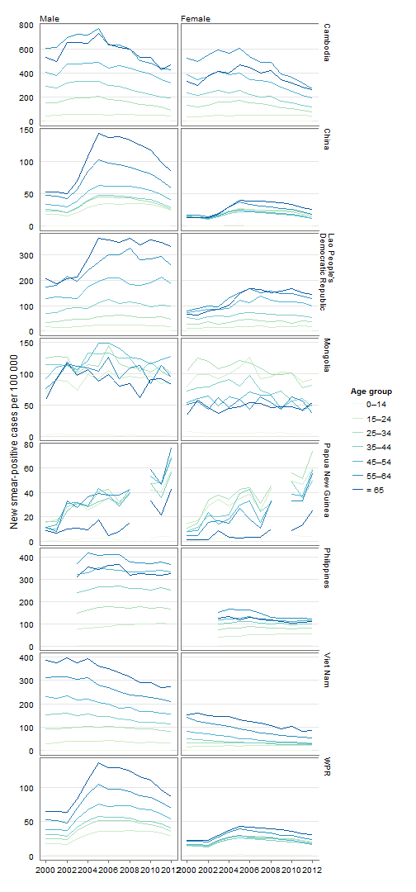
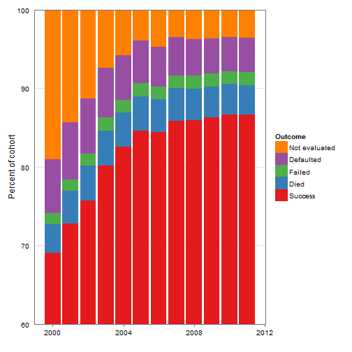
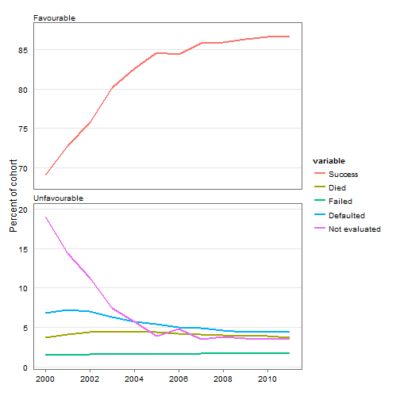
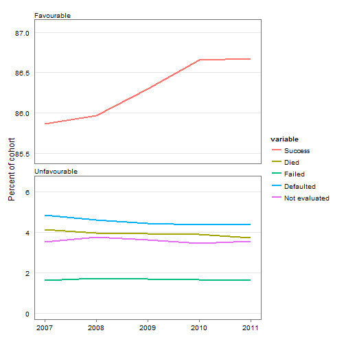
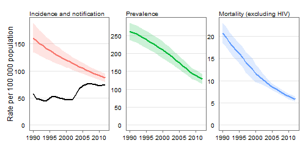

Regional TB report 2013
========================================================

Abstract 
--------------------------------------------------------

### Background

### Methods

### Results

### Conclusion

Introduction
--------------------------------------------------------

The Western Pacific Region has seen significant gains in the fight against tuberculosis (TB) in the last decade with estimated incidence rates 

Methods
--------------------------------------------------------

Data were collected through an on-line data collection system.

Results
--------------------------------------------------------

### Case notification

In 2012, national TB control programmes (NTPs) reported 1.4 million people with TB in the region ([Table 1](#t-notif)) making up 23% of the global burden. Of these cases 97% were new episodes of TB (either new or relapse cases). Within the region China accounts for 65% of the caseload with the Philippines and Viet Nam following with 16% and 7% respectively. TB notification rates vary substantially in the region with the highest rates found in Kiribati, Papua New Guinea, Marshall Islands and Cambodia ([Figure 1](#m-notif)). 

 
#### Table 1. Case notifications, 2012.
<!-- html table generated in R 3.0.2 by xtable 1.7-1 package -->
<!-- Thu Feb 13 21:54:52 2014 -->
<TABLE border=0 rules=rows width=900 cellpadding=5>
  <TR> <TD colspan=3></TD> 
  <TH colspan=7>NEW CASES</TH> 
  <TH colspan=2>RETREATMENT CASES</TH> 
  <TD colspan=1></TD> </TR> 
  <TR> <TD></TD> <TD>TOTAL NOTIFIED</TD>
  <TD>TOTAL NOTIFIED PER 100 000</TD>
  <TD>SMEAR- POSITIVE</TD> 
  <TD>SMEAR- NEGATIVE</TD> 
  <TD>SMEAR NOT DONE</TD>
  <TD>EXTRA- PULMONARY</TD> 
  <TD>CASE TYPE  UNKNOWN</TD> 
  <TD>PULMONARY CASES LABORATORY CONFIRMED</TD> 
  <TD>PERCENTAGE OF PULMONARY CASES LABORATORY CONFIRMED</TD>   
  <TD>RELAPSE</TD> 
  <TD>RETREATMENT EXCL. RELAPSE</TD> 
  <TD>NEW AND RELAPSE(a)</TD> 
 </TR> <TR> <TD> American Samoa </TD> <TD>  </TD> <TD>  </TD> <TD>  </TD> <TD>  </TD> <TD>  </TD> <TD>  </TD> <TD>  </TD> <TD>  </TD> <TD> -- </TD> <TD>  </TD> <TD>  </TD> <TD>  </TD> </TR>
  <TR> <TD> Australia </TD> <TD> 1 325 </TD> <TD> 6 </TD> <TD> 290 </TD> <TD> 330 </TD> <TD> 78 </TD> <TD> 498 </TD> <TD> 63 </TD> <TD> 667 </TD> <TD> 96 </TD> <TD> 26 </TD> <TD> 20 </TD> <TD> 1 305 </TD> </TR>
  <TR> <TD> Brunei Darussalam </TD> <TD> 243 </TD> <TD> 59 </TD> <TD> 119 </TD> <TD> 51 </TD> <TD> 28 </TD> <TD> 31 </TD> <TD> 0 </TD> <TD> 166 </TD> <TD> 84 </TD> <TD> 14 </TD> <TD> 0 </TD> <TD> 243 </TD> </TR>
  <TR> <TD> Cambodia </TD> <TD> 40 258 </TD> <TD> 270 </TD> <TD> 14 838 </TD> <TD> 8 509 </TD> <TD> 0 </TD> <TD> 15 290 </TD> <TD> 0 </TD> <TD> 14 838 </TD> <TD> 64 </TD> <TD> 446 </TD> <TD> 73 </TD> <TD> 40 185 </TD> </TR>
  <TR> <TD> China </TD> <TD> 900 678 </TD> <TD> 65 </TD> <TD> 316 332 </TD> <TD> 533 977 </TD> <TD> 2 073 </TD> <TD> 6 479 </TD> <TD> 0 </TD> <TD> 316 332 </TD> <TD> 37 </TD> <TD> 31 784 </TD> <TD> 10 033 </TD> <TD> 890 645 </TD> </TR>
  <TR> <TD> China, Hong Kong SAR </TD> <TD> 4 969 </TD> <TD> 67 </TD> <TD> 1 463 </TD> <TD> 2 004 </TD> <TD> 202 </TD> <TD> 817 </TD> <TD> 0 </TD> <TD> 2 704 </TD> <TD> 74 </TD> <TD> 323 </TD> <TD> 160 </TD> <TD> 4 809 </TD> </TR>
  <TR> <TD> China, Macao SAR </TD> <TD> 406 </TD> <TD> 73 </TD> <TD> 156 </TD> <TD> 137 </TD> <TD> 2 </TD> <TD> 31 </TD> <TD> 0 </TD> <TD> 241 </TD> <TD> 82 </TD> <TD> 26 </TD> <TD> 2 </TD> <TD> 404 </TD> </TR>
  <TR> <TD> Cook Islands </TD> <TD> 1 </TD> <TD> 5 </TD> <TD> 0 </TD> <TD> 0 </TD> <TD> 0 </TD> <TD> 0 </TD> <TD> 0 </TD> <TD> 0 </TD> <TD> -- </TD> <TD> 1 </TD> <TD> 0 </TD> <TD> 1 </TD> </TR>
  <TR> <TD> Fiji </TD> <TD> 218 </TD> <TD> 24 </TD> <TD> 111 </TD> <TD> 54 </TD> <TD> 0 </TD> <TD> 40 </TD> <TD> 0 </TD> <TD> 165 </TD> <TD> 100 </TD> <TD> 5 </TD> <TD> 8 </TD> <TD> 210 </TD> </TR>
  <TR> <TD> French Polynesia </TD> <TD> 50 </TD> <TD> 18 </TD> <TD> 26 </TD> <TD> 10 </TD> <TD> 0 </TD> <TD> 8 </TD> <TD> 0 </TD> <TD> 33 </TD> <TD> 92 </TD> <TD> 6 </TD> <TD> 0 </TD> <TD> 50 </TD> </TR>
  <TR> <TD> Guam </TD> <TD> 68 </TD> <TD> 42 </TD> <TD> 23 </TD> <TD> 23 </TD> <TD> 14 </TD> <TD> 8 </TD> <TD> 0 </TD> <TD> 31 </TD> <TD> 52 </TD> <TD> 0 </TD> <TD> 0 </TD> <TD> 68 </TD> </TR>
  <TR> <TD> Japan </TD> <TD> 21 283 </TD> <TD> 16 </TD> <TD> 7 663 </TD> <TD> 7 454 </TD> <TD> 221 </TD> <TD> 4 609 </TD> <TD> 0 </TD> <TD> 13 013 </TD> <TD> 85 </TD> <TD> 910 </TD> <TD> 426 </TD> <TD> 20 857 </TD> </TR>
  <TR> <TD> Kiribati </TD> <TD> 348 </TD> <TD> 343 </TD> <TD> 134 </TD> <TD> 122 </TD> <TD> 0 </TD> <TD> 73 </TD> <TD> 9 </TD> <TD> 134 </TD> <TD> 52 </TD> <TD> 8 </TD> <TD> 2 </TD> <TD> 346 </TD> </TR>
  <TR> <TD> Lao People's Democratic Republic </TD> <TD> 4 156 </TD> <TD> 62 </TD> <TD> 3 062 </TD> <TD> 484 </TD> <TD>  </TD> <TD> 351 </TD> <TD>  </TD> <TD> 3 062 </TD> <TD> 86 </TD> <TD> 168 </TD> <TD> 38 </TD> <TD> 4 118 </TD> </TR>
  <TR> <TD> Malaysia </TD> <TD> 22 710 </TD> <TD> 75 </TD> <TD> 13 311 </TD> <TD> 4 941 </TD> <TD> 52 </TD> <TD> 2 945 </TD> <TD> 0 </TD> <TD> 13 311 </TD> <TD> 73 </TD> <TD> 602 </TD> <TD> 859 </TD> <TD> 21 851 </TD> </TR>
  <TR> <TD> Marshall Islands </TD> <TD> 147 </TD> <TD> 276 </TD> <TD> 54 </TD> <TD> 39 </TD> <TD> 14 </TD> <TD> 29 </TD> <TD> 0 </TD> <TD> 54 </TD> <TD> 50 </TD> <TD> 4 </TD> <TD> 2 </TD> <TD> 145 </TD> </TR>
  <TR> <TD> Micronesia (Federated States of) </TD> <TD> 146 </TD> <TD> 139 </TD> <TD> 43 </TD> <TD> 75 </TD> <TD> 2 </TD> <TD> 22 </TD> <TD> 0 </TD> <TD> 58 </TD> <TD> 48 </TD> <TD> 2 </TD> <TD> 2 </TD> <TD> 144 </TD> </TR>
  <TR> <TD> Mongolia </TD> <TD> 4 453 </TD> <TD> 148 </TD> <TD> 1 716 </TD> <TD> 617 </TD> <TD> 0 </TD> <TD> 1 611 </TD> <TD> 0 </TD> <TD> 1 716 </TD> <TD> 74 </TD> <TD> 184 </TD> <TD> 325 </TD> <TD> 4 128 </TD> </TR>
  <TR> <TD> Nauru </TD> <TD>  </TD> <TD>  </TD> <TD>  </TD> <TD>  </TD> <TD>  </TD> <TD>  </TD> <TD>  </TD> <TD>  </TD> <TD> -- </TD> <TD>  </TD> <TD>  </TD> <TD>  </TD> </TR>
  <TR> <TD> New Caledonia </TD> <TD> 38 </TD> <TD> 15 </TD> <TD> 13 </TD> <TD> 11 </TD> <TD> 0 </TD> <TD> 12 </TD> <TD> 1 </TD> <TD> 24 </TD> <TD> 100 </TD> <TD> 1 </TD> <TD> 0 </TD> <TD> 38 </TD> </TR>
  <TR> <TD> New Zealand </TD> <TD> 297 </TD> <TD> 7 </TD> <TD> 68 </TD> <TD> 88 </TD> <TD> 11 </TD> <TD> 112 </TD> <TD> 3 </TD> <TD> 143 </TD> <TD> 86 </TD> <TD> 11 </TD> <TD> 4 </TD> <TD> 293 </TD> </TR>
  <TR> <TD> Niue </TD> <TD> 0 </TD> <TD> 0 </TD> <TD> 0 </TD> <TD> 0 </TD> <TD> 0 </TD> <TD> 0 </TD> <TD> 0 </TD> <TD> 0 </TD> <TD> -- </TD> <TD> 0 </TD> <TD> 0 </TD> <TD> 0 </TD> </TR>
  <TR> <TD> Northern Mariana Islands </TD> <TD> 34 </TD> <TD> 60 </TD> <TD> 10 </TD> <TD> 17 </TD> <TD> 0 </TD> <TD> 4 </TD> <TD> 1 </TD> <TD> 15 </TD> <TD> 56 </TD> <TD> 0 </TD> <TD> 2 </TD> <TD> 32 </TD> </TR>
  <TR> <TD> Palau </TD> <TD> 4 </TD> <TD> 19 </TD> <TD> 3 </TD> <TD> 1 </TD> <TD> 0 </TD> <TD> 0 </TD> <TD> 0 </TD> <TD> 3 </TD> <TD> 75 </TD> <TD> 0 </TD> <TD> 0 </TD> <TD> 4 </TD> </TR>
  <TR> <TD> Papua New Guinea </TD> <TD> 22 488 </TD> <TD> 287 </TD> <TD> 2 862 </TD> <TD> 2 046 </TD> <TD> 7 149 </TD> <TD> 8 277 </TD> <TD> 0 </TD> <TD> 2 862 </TD> <TD> 24 </TD> <TD> 223 </TD> <TD> 1 931 </TD> <TD> 20 557 </TD> </TR>
  <TR> <TD> Philippines </TD> <TD> 230 162 </TD> <TD> 224 </TD> <TD> 94 006 </TD> <TD> 115 263 </TD> <TD> 0 </TD> <TD> 3 274 </TD> <TD> 0 </TD> <TD> 94 006 </TD> <TD> 45 </TD> <TD> 4 084 </TD> <TD> 13 535 </TD> <TD> 216 627 </TD> </TR>
  <TR> <TD> Republic of Korea </TD> <TD> 49 532 </TD> <TD> 89 </TD> <TD> 12 137 </TD> <TD> 15 622 </TD> <TD> 3 316 </TD> <TD> 8 470 </TD> <TD> 0 </TD> <TD> 28 397 </TD> <TD> 91 </TD> <TD> 4 157 </TD> <TD> 5 830 </TD> <TD> 43 702 </TD> </TR>
  <TR> <TD> Samoa </TD> <TD> 22 </TD> <TD> 12 </TD> <TD> 15 </TD> <TD> 4 </TD> <TD> 0 </TD> <TD> 3 </TD> <TD> 0 </TD> <TD> 19 </TD> <TD> 100 </TD> <TD> 0 </TD> <TD> 0 </TD> <TD> 22 </TD> </TR>
  <TR> <TD> Singapore </TD> <TD> 2 364 </TD> <TD> 43 </TD> <TD> 678 </TD> <TD> 1 093 </TD> <TD> 126 </TD> <TD> 306 </TD> <TD> 0 </TD> <TD> 1 206 </TD> <TD> 64 </TD> <TD> 98 </TD> <TD> 63 </TD> <TD> 2 301 </TD> </TR>
  <TR> <TD> Solomon Islands </TD> <TD> 372 </TD> <TD> 66 </TD> <TD> 157 </TD> <TD> 87 </TD> <TD> 0 </TD> <TD> 112 </TD> <TD> 0 </TD> <TD> 157 </TD> <TD> 64 </TD> <TD> 5 </TD> <TD> 11 </TD> <TD> 361 </TD> </TR>
  <TR> <TD> Tokelau </TD> <TD>  </TD> <TD>  </TD> <TD>  </TD> <TD>  </TD> <TD>  </TD> <TD>  </TD> <TD>  </TD> <TD>  </TD> <TD> -- </TD> <TD>  </TD> <TD>  </TD> <TD>  </TD> </TR>
  <TR> <TD> Tonga </TD> <TD> 11 </TD> <TD> 10 </TD> <TD> 9 </TD> <TD> 1 </TD> <TD> 0 </TD> <TD> 1 </TD> <TD> 0 </TD> <TD> 10 </TD> <TD> 100 </TD> <TD> 0 </TD> <TD> 0 </TD> <TD> 11 </TD> </TR>
  <TR> <TD> Tuvalu </TD> <TD> 20 </TD> <TD> 193 </TD> <TD> 8 </TD> <TD> 2 </TD> <TD> 0 </TD> <TD> 9 </TD> <TD> 0 </TD> <TD> 9 </TD> <TD> 90 </TD> <TD> 0 </TD> <TD> 1 </TD> <TD> 19 </TD> </TR>
  <TR> <TD> Vanuatu </TD> <TD> 126 </TD> <TD> 51 </TD> <TD> 51 </TD> <TD> 22 </TD> <TD> 0 </TD> <TD> 51 </TD> <TD> 0 </TD> <TD> 73 </TD> <TD> 100 </TD> <TD> 1 </TD> <TD> 1 </TD> <TD> 125 </TD> </TR>
  <TR> <TD> Viet Nam </TD> <TD> 103 906 </TD> <TD> 112 </TD> <TD> 51 033 </TD> <TD> 21 706 </TD> <TD>  </TD> <TD> 18 904 </TD> <TD> 3 210 </TD> <TD> 51 033 </TD> <TD> 70 </TD> <TD> 7 259 </TD> <TD> 1 794 </TD> <TD> 102 112 </TD> </TR>
  <TR> <TD> Wallis and Futuna Islands </TD> <TD>  </TD> <TD>  </TD> <TD>  </TD> <TD>  </TD> <TD>  </TD> <TD>  </TD> <TD>  </TD> <TD>  </TD> <TD> -- </TD> <TD>  </TD> <TD>  </TD> <TD>  </TD> </TR>
  <TR> <TD> WPR </TD> <TD> 1 410 835 </TD> <TD> 75 </TD> <TD> 520 391 </TD> <TD> 714 790 </TD> <TD> 13 288 </TD> <TD> 72 377 </TD> <TD> 3 287 </TD> <TD> 544 482 </TD> <TD> 44 </TD> <TD> 50 348 </TD> <TD> 35 122 </TD> <TD> 1 375 713 </TD> </TR>
   <TR> <TD colspan=13>Blank cells indicate data not reported. -- indicates values that cannot be calculated. 
(a) NEW AND RELAPSE includes cases for which the treatment history is unknown. </TD></TR> </TABLE>

 
#### Figure 1 New and relapse rates per 100 000 population in countries and areas of the Western Pacific Region, 2012.
 

 
#### Figure 2 Case notification rates per 100 000 population in countries and areas of the Western Pacific Region, 2000--2012.
 

## Age and sex

The age distribution in 2012 follows an increasing pattern characteristic of an aging epidemic for all high-burden countries except Mongolia and Papua New Guinea ([Figure 3](#f-agesex-bar)). Rates among females is less similar with rates in the ≥ 65 category lower than their younger counter-parts in many settings.

 
#### Figure 3 Smear-positive notification rates by age and sex in the Region and in seven countries with a high burden of TB, 2012.
 

 
#### Figure 4 Trends of notification rates of new smear-positive TB cases in specific age and sex groups, 2012.
 

As seen in [Figure 4](#f-agesex) the trend is evident.

## Treatment outcomes

 
#### Figure 5 Treatment outcomes for new smear-positive cases in the Region, 2000--2011.
   

## TB/HIV

 
#### Figure 6 Progress in TB/HIV activities in seven countries in the Region with a high burden of TB, 2005--2012.
 

Discussion
--------------------------------------------------------

 
#### Figure 7 Tuberculosis case notification rate per 100 000 population, estimated incidence, prevalence and mortality in the Western Pacific Region, 1990--2011.
 

Annex
--------------------------------------------------------

The annex will go here.

